```markdown
# TaskFlow Socket Service

# Real-time WebSocket Server

<div align="center">


" width="120" height="120">

### A standalone Socket.io server for real-time task management

### Handles live updates, notifications, and collaborative features

---

## Deployed Service

### [https://taskflow-socket-production.up.railway.app](https://taskflow-socket-production.up.railway.app)

### Socket endpoint for TaskFlow application

---

**Main Application:** [https://taskflow-fawn-psi.vercel.app](https://taskflow-fawn-psi.vercel.app)

**Source Code:** [https://github.com/anshsharmacse/taskflow-socket](https://github.com/anshsharmacse/taskflow-socket)

---


</div>

---

## Overview

This microservice provides real-time WebSocket communication for the TaskFlow collaborative task management application. Built with Socket.io, it enables instant updates across all connected clients when tasks are created, updated, or deleted.

### Why a Separate Socket Service?

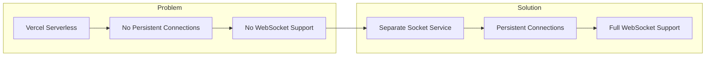

**Problem Explained:** Vercel's serverless architecture doesn't support persistent WebSocket connections. Each serverless function is ephemeral and terminates after request completion, making real-time communication impossible.

**Solution Explained:** A dedicated Socket.io server deployed on Railway maintains persistent connections with clients, enabling true real-time bidirectional communication.

---

## Architecture

### System Integration

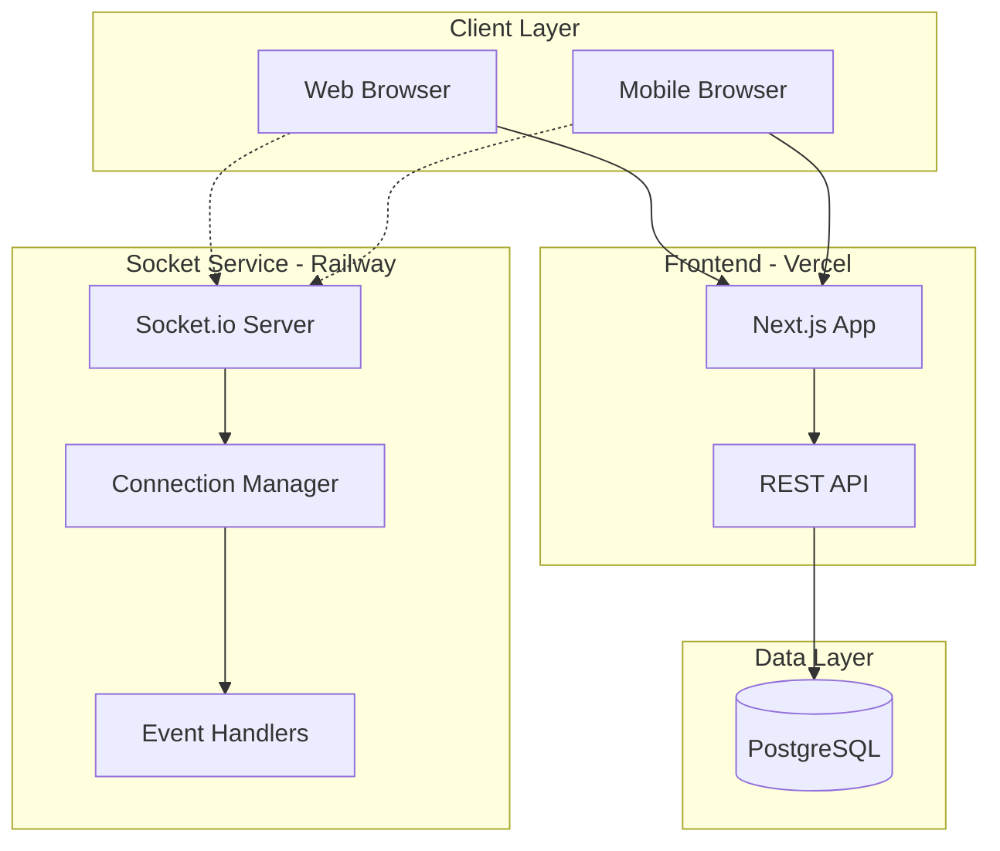

**Integration Explained:** The socket service runs independently from the main Next.js application. Clients connect to both the REST API (for CRUD operations) and the Socket server (for real-time updates) simultaneously.

### Connection Flow

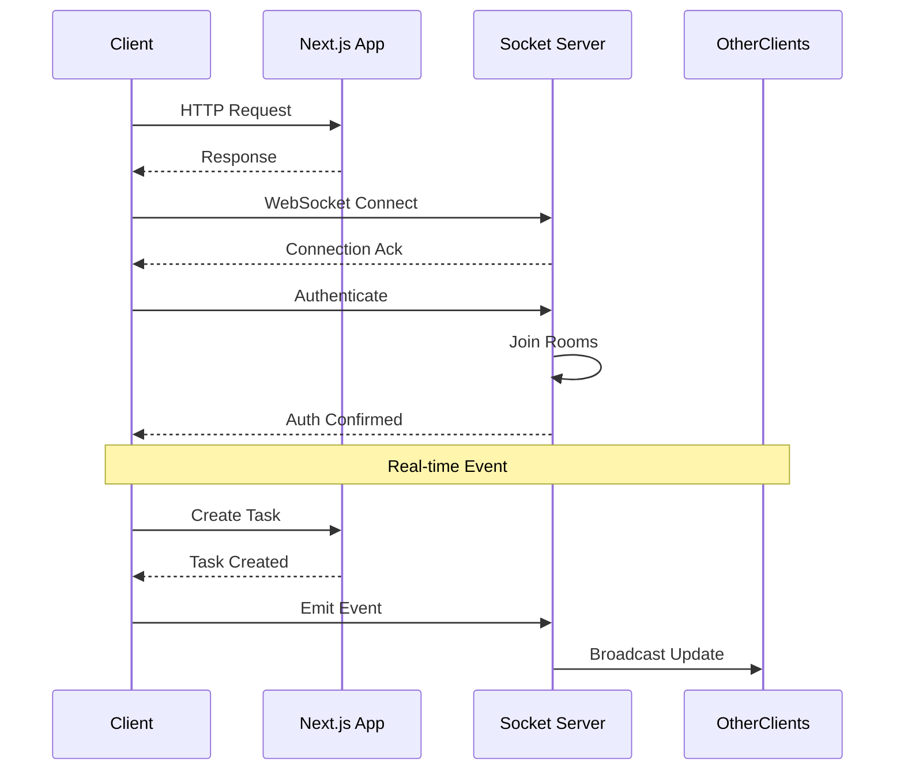

**Flow Explained:** Clients establish dual connections - HTTP for API calls and WebSocket for real-time updates. After authentication, clients join specific rooms based on their user ID and email for targeted notifications.

---

## Features

| Feature | Description |
|---------|-------------|
| **Real-time Broadcasting** | Instant task updates to all relevant users |
| **Room-based Routing** | Targeted notifications using user rooms |
| **Auto-reconnection** | Automatic reconnection on connection drop |
| **CORS Protection** | Secure cross-origin requests |
| **Graceful Fallback** | HTTP long-polling fallback if WebSocket fails |

### Event System

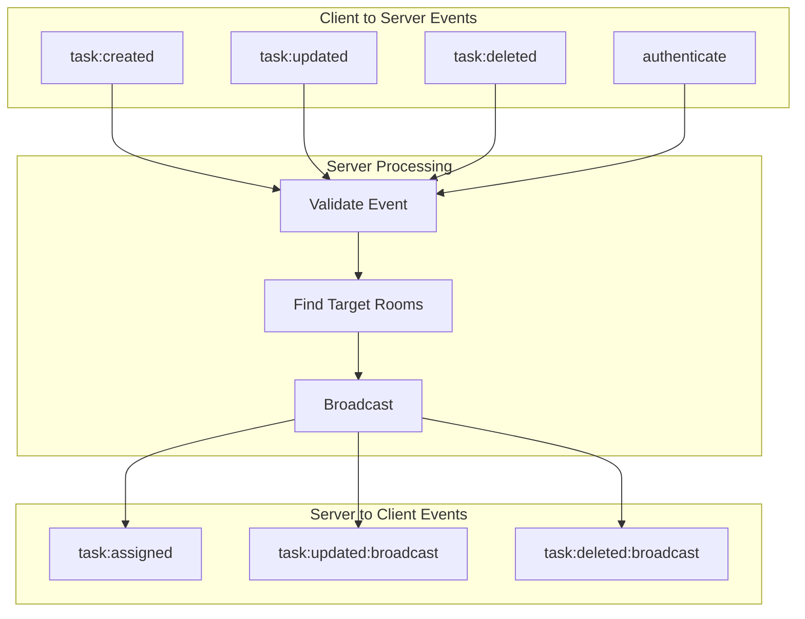

**Event Flow Explained:** Clients emit events for actions they perform. The server validates each event, determines which rooms should receive the notification, and broadcasts to all relevant clients.

---

## Room Strategy

### Room Types

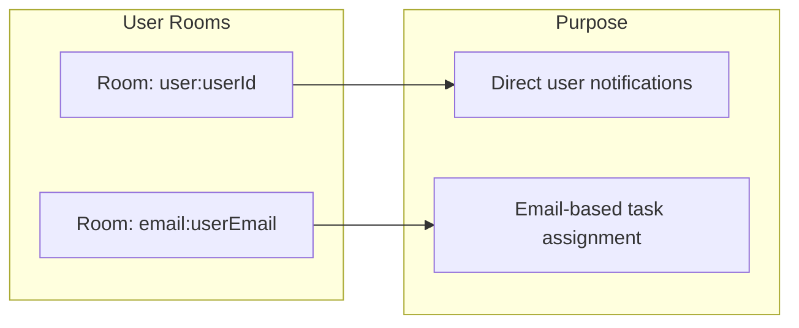

**Room Strategy Explained:** Each user joins two rooms upon connection. The user ID room enables direct notifications. The email room ensures users receive tasks assigned to their email before they registered.

### Broadcasting Logic

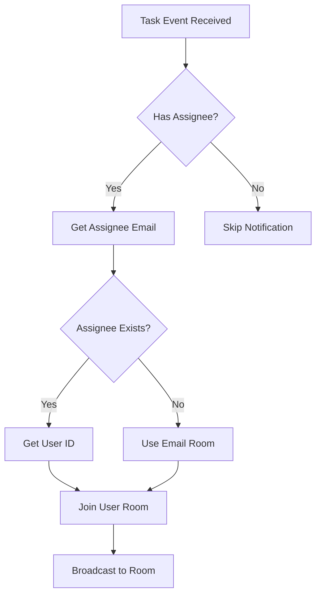

**Broadcasting Explained:** When a task is assigned, the server determines the target room. If the assignee exists, it uses their user ID room. If not, it uses the email room so the task is waiting when they sign up.

---

## API Reference

### Connection

```javascript
// Connect to socket server
const socket = io('https://taskflow-socket-production.up.railway.app', {
  transports: ['websocket', 'polling'],
  withCredentials: true
});
```

### Events

#### Client to Server

| Event | Payload | Description |
|-------|---------|-------------|
| `authenticate` | `{ userId, email }` | Authenticate and join rooms |
| `task:created` | `{ task }` | Notify new task creation |
| `task:updated` | `{ taskId, updates }` | Notify task update |
| `task:deleted` | `{ taskId, assigneeEmail }` | Notify task deletion |

#### Server to Client

| Event | Payload | Description |
|-------|---------|-------------|
| `authenticated` | `{ success, rooms }` | Authentication confirmation |
| `task:assigned` | `{ task }` | New task assigned to user |
| `task:updated:broadcast` | `{ taskId, updates }` | Task update notification |
| `task:deleted:broadcast` | `{ taskId }` | Task deletion notification |

### Usage Example

```javascript
// Client-side implementation
import { io } from 'socket.io-client';

const socket = io(SOCKET_URL, {
  transports: ['websocket', 'polling']
});

// Authenticate on connection
socket.on('connect', () => {
  socket.emit('authenticate', {
    userId: user.id,
    email: user.email
  });
});

// Listen for task assignments
socket.on('task:assigned', (data) => {
  // Add new task to UI
  addTaskToStore(data.task);
});

// Notify on task creation
const createTask = async (task) => {
  const response = await fetch('/api/tasks', {
    method: 'POST',
    body: JSON.stringify(task)
  });
  
  const newTask = await response.json();
  socket.emit('task:created', { task: newTask });
};
```

---

## Deployment

### Railway Deployment

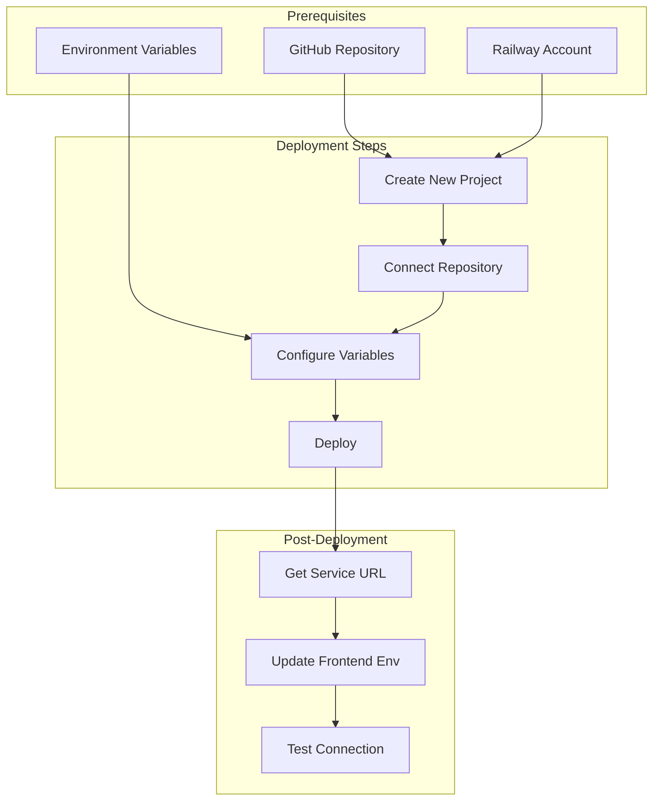

**Deployment Process Explained:** Deploy to Railway by connecting your GitHub repository, setting environment variables, and letting Railway handle the build and deployment automatically.

### Environment Variables

| Variable | Required | Description | Example |
|----------|----------|-------------|---------|
| `PORT` | Yes | Server port | `3003` |
| `CORS_ORIGIN` | Yes | Allowed frontend origin | `https://taskflow-fawn-psi.vercel.app` |

### Railway Configuration

```toml
# railway.toml
[build]
builder = "nixpacks"

[deploy]
startCommand = "bun run start"
healthcheckPath = "/health"
healthcheckTimeout = 100
restartPolicyType = "on_failure"
restartPolicyMaxRetries = 3
```

---

## Local Development

### Prerequisites

| Requirement | Version |
|-------------|---------|
| Node.js | 18.x+ |
| Bun | Latest |

### Quick Start

```bash
# Clone repository
git clone https://github.com/anshsharmacse/taskflow-socket.git
cd taskflow-socket

# Install dependencies
bun install

# Create environment file
cp .env.example .env

# Configure variables
# PORT=3003
# CORS_ORIGIN=http://localhost:3000

# Start development server
bun run dev
```

### Project Structure

```
taskflow-socket/
├── src/
│   └── index.ts          # Main server entry
├── package.json
├── tsconfig.json
├── .env.example
└── README.md
```

---

## Monitoring

### Health Check Endpoint

```javascript
// GET /health
{
  "status": "ok",
  "uptime": 3600,
  "connections": 42
}
```

### Logging

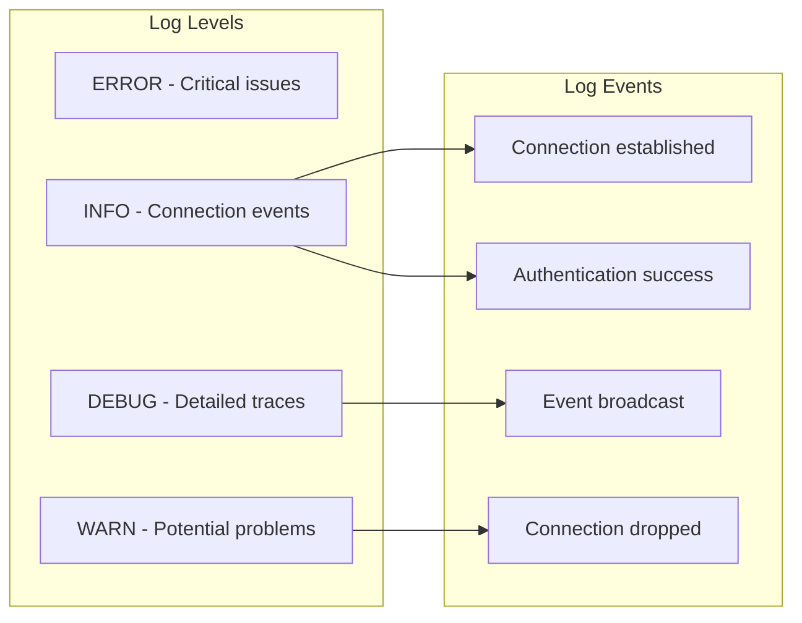

**Logging Strategy Explained:** The service logs key events at appropriate levels. Connections and authentications are INFO level. Event broadcasts are DEBUG for troubleshooting. Disconnections are WARN to track potential issues.

---

## Security

### CORS Configuration

```javascript
const io = new Server(httpServer, {
  cors: {
    origin: process.env.CORS_ORIGIN,
    methods: ['GET', 'POST'],
    credentials: true
  }
});
```

### Authentication Flow

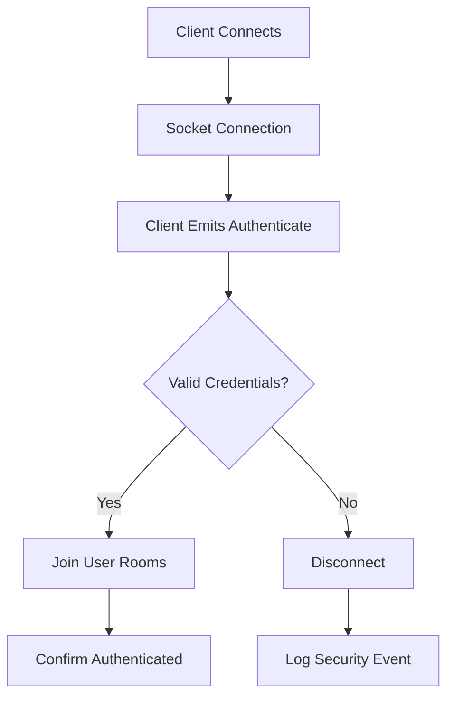

**Security Flow Explained:** Every socket connection must authenticate before joining rooms. Unauthenticated connections are disconnected, and security events are logged for monitoring.

---

## Performance

### Connection Pooling

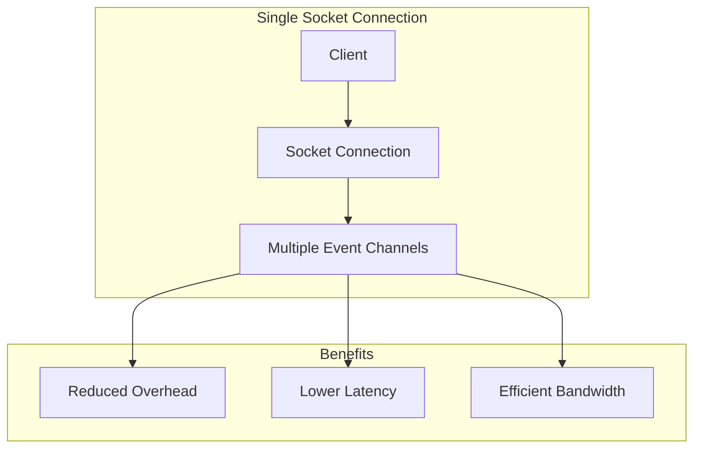

**Pooling Benefits Explained:** A single WebSocket connection multiplexes all events, reducing connection overhead compared to multiple HTTP requests. This results in lower latency and more efficient bandwidth usage.

### Scalability Considerations

| Factor | Current | Future |
|--------|---------|--------|
| Connections | Single Instance | Socket.io Cluster |
| Rooms | In-Memory | Redis Adapter |
| Persistence | None | Redis for Pub/Sub |

---

## Troubleshooting

### Common Issues

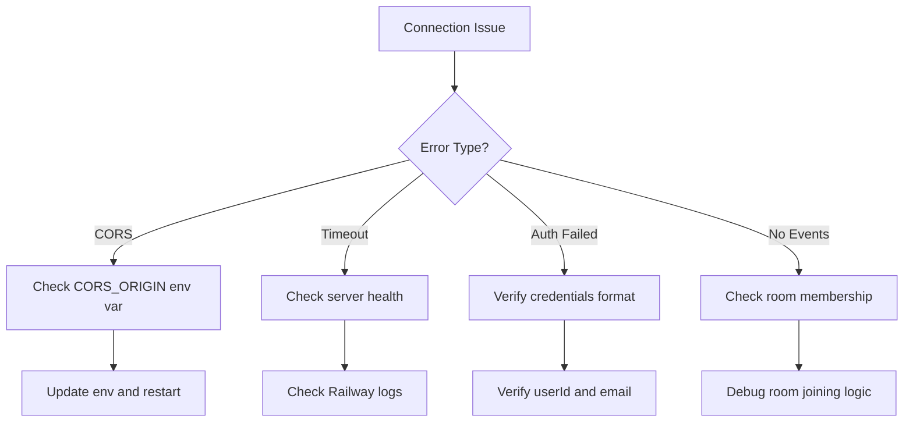

**Troubleshooting Guide Explained:** Most issues fall into four categories. CORS errors require environment variable fixes. Timeouts indicate server problems. Auth failures need credential verification. Missing events suggest room membership issues.

### Debug Mode

```bash
# Enable debug logging
DEBUG=socket.io* bun run dev
```

---

## Developer Information

<div align="center">

### **Ansh Sharma**

**National Institute of Technology Calicut**

---

[](https://github.com/anshsharmacse)

[](https://www.linkedin.com/in/anshsharmacse/)

</div>

---

## License

This project is released under the MIT License.

---

<div align="center">

**Built with Socket.io and deployed on Railway**

</div>
```
