# TaskFlow Socket Service

# Real-time WebSocket Server

<div align="center">


### A standalone Socket.io server for real-time task management

### Handles live updates, notifications, and collaborative features

---

## Deployed Service

### [https://taskflow-socket-production.up.railway.app](https://taskflow-socket-production.up.railway.app)

### Socket endpoint for TaskFlow application

---

**Main Application:** [https://taskflow-fawn-psi.vercel.app](https://taskflow-fawn-psi.vercel.app)

**Source Code:** [https://github.com/anshsharmacse/taskflow-socket](https://github.com/anshsharmacse/taskflow-socket)

---


</div>

---

## Overview

This microservice provides real-time WebSocket communication for the TaskFlow collaborative task management application. Built with Socket.io, it enables instant updates across all connected clients when tasks are created, updated, or deleted.

### Why a Separate Socket Service?

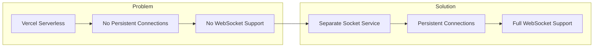

**Problem Explained:** Vercel's serverless architecture doesn't support persistent WebSocket connections. Each serverless function is ephemeral and terminates after request completion, making real-time communication impossible.

**Solution Explained:** A dedicated Socket.io server deployed on Railway maintains persistent connections with clients, enabling true real-time bidirectional communication.

---

## Architecture

### System Integration

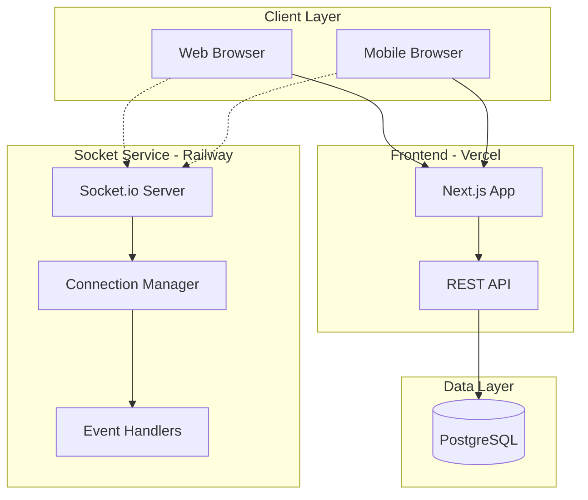

**Integration Explained:** The socket service runs independently from the main Next.js application. Clients connect to both the REST API for CRUD operations and the Socket server for real-time updates simultaneously.

### Connection Flow

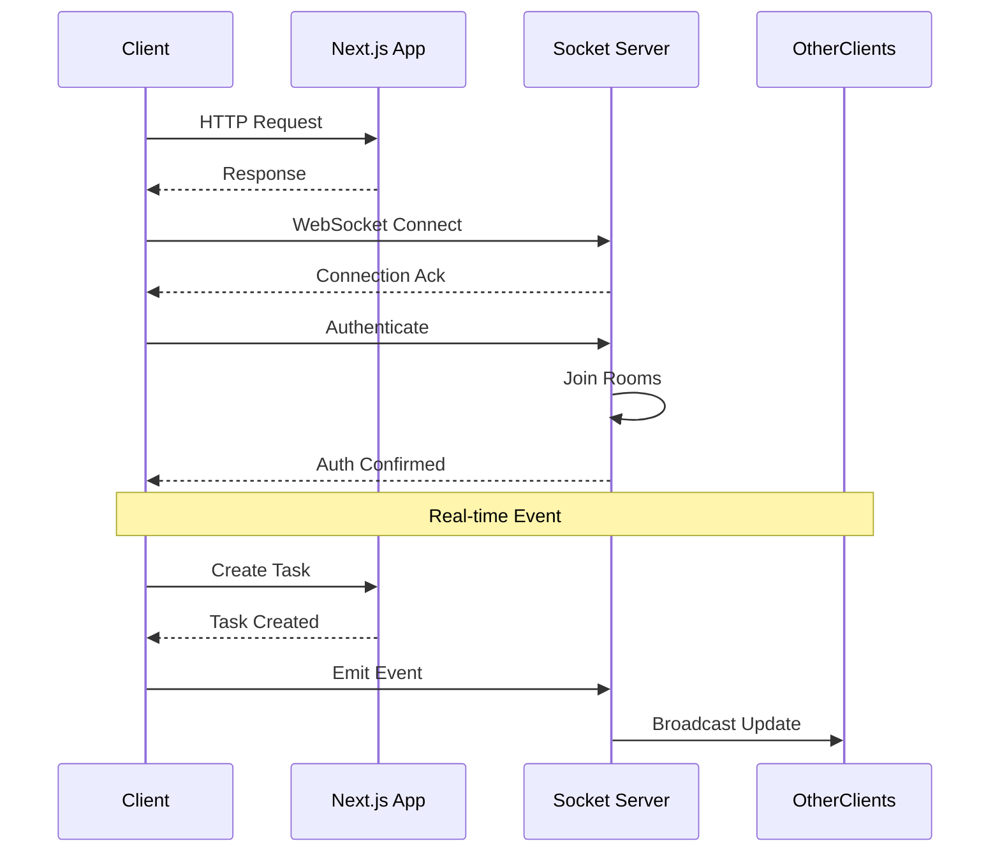

**Flow Explained:** Clients establish dual connections - HTTP for API calls and WebSocket for real-time updates. After authentication, users join specific rooms to receive targeted notifications.

---

## Event System

### Event Types

| Event | Direction | Description |
|-------|-----------|-------------|
| `connection` | Client to Server | Initial WebSocket connection |
| `authenticate` | Client to Server | Send user credentials |
| `task:created` | Client to Server | New task created notification |
| `task:updated` | Client to Server | Task modified notification |
| `task:deleted` | Client to Server | Task removed notification |
| `task:assigned` | Server to Client | Task assignment notification |

### Event Flow Diagram

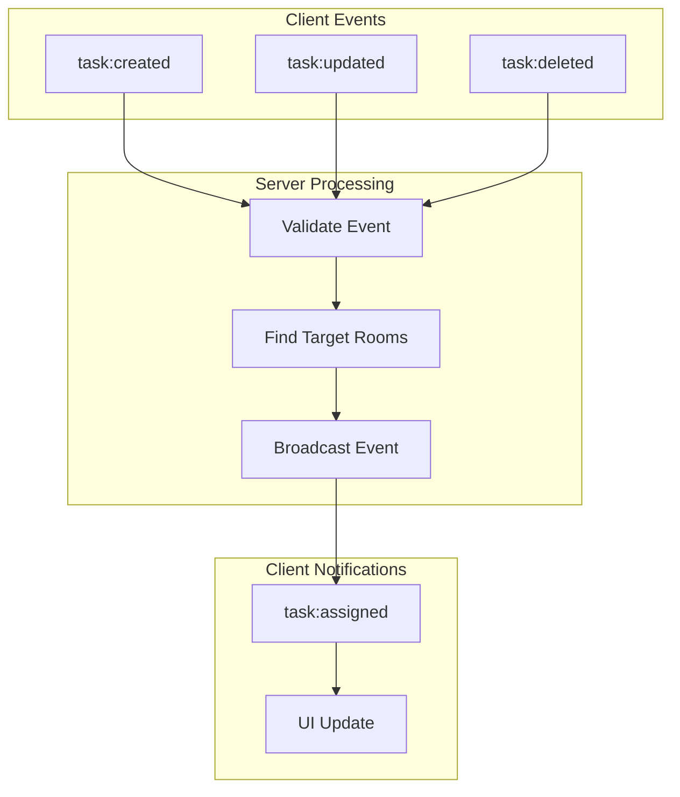

**Event Processing Explained:** Each event goes through validation, room identification, and broadcasting. The server determines which clients should receive the notification based on task ownership and assignment.

---

## Room System

### Room Types

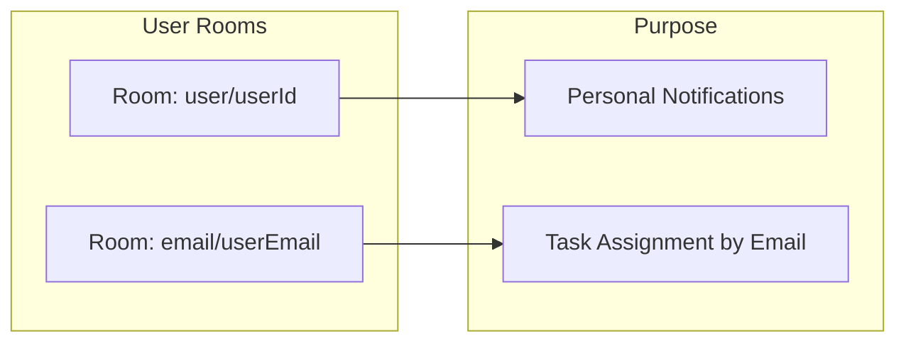

**Room System Explained:** Each user joins two rooms upon authentication. The user ID room handles personal notifications, while the email room enables task assignment before user registration.

### Room Joining Logic

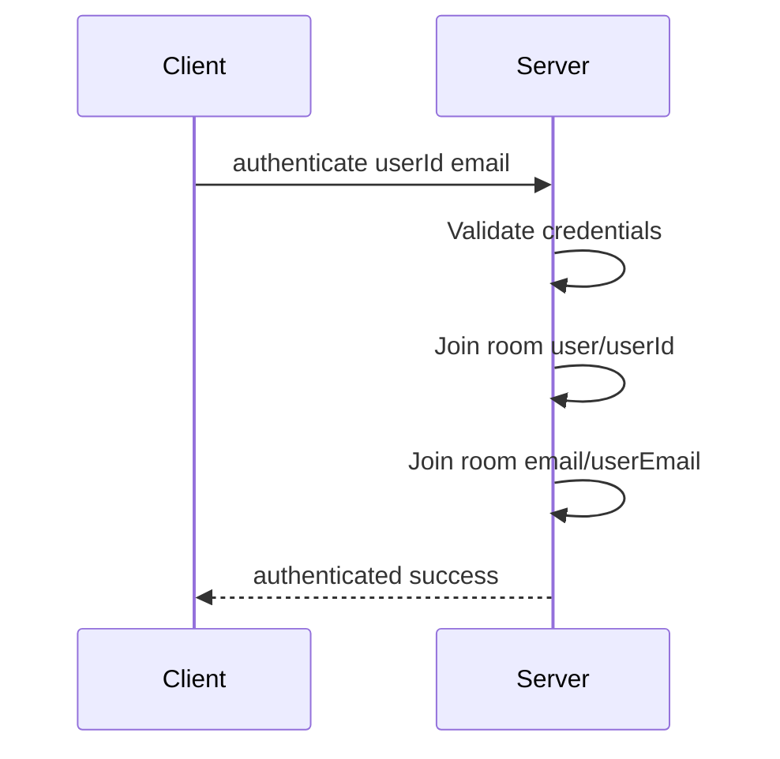

**Join Sequence Explained:** After successful authentication, the server automatically joins the client to both their user ID room and email room. This ensures they receive all relevant notifications.

---

## Project Structure

```
taskflow-socket/
├── src/
│   └── index.ts          # Main server entry point
├── package.json          # Dependencies and scripts
├── tsconfig.json         # TypeScript configuration
└── README.md             # Documentation
```

### Key Files

| File | Purpose |
|------|---------|
| `src/index.ts` | Socket.io server initialization and event handlers |
| `package.json` | Project dependencies and run scripts |
| `tsconfig.json` | TypeScript compiler settings |

---

## API Reference

### Server Configuration

```typescript
const io = new Server(httpServer, {
  cors: {
    origin: process.env.CORS_ORIGIN,
    methods: ["GET", "POST"],
    credentials: true,
  },
});
```

### Authentication Event

```typescript
// Client emits
socket.emit("authenticate", {
  userId: "user_id",
  email: "user@example.com"
});

// Server responds
socket.emit("authenticated", { success: true });
```

### Task Events

```typescript
// Task created
socket.emit("task:created", {
  task: { id, title, assigneeEmail }
});

// Task updated
socket.emit("task:updated", {
  taskId: "task_id",
  updates: { status, priority }
});

// Task deleted
socket.emit("task:deleted", {
  taskId: "task_id"
});
```

---

## Deployment

### Railway Deployment Steps

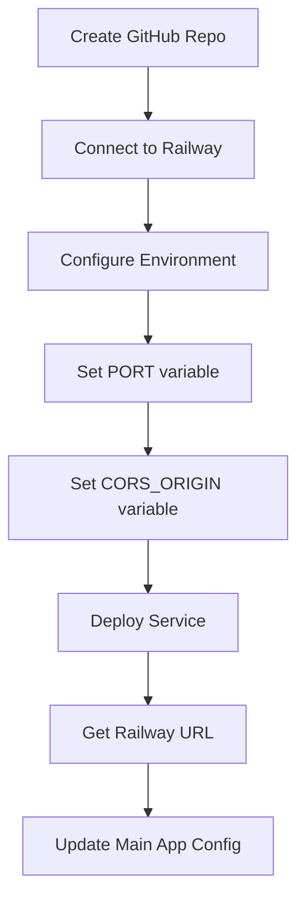

**Deployment Process Explained:** The service is deployed to Railway which provides persistent WebSocket support. After deployment, update the main application with the socket URL.

### Environment Variables

| Variable | Required | Description | Example |
|----------|----------|-------------|---------|
| `PORT` | Yes | Server listening port | `3003` |
| `CORS_ORIGIN` | Yes | Allowed frontend origin | `https://your-app.vercel.app` |

---

## Local Development

### Prerequisites

| Requirement | Version | Purpose |
|-------------|---------|---------|
| Node.js or Bun | 18+ / Latest | JavaScript runtime |
| TypeScript | 5.x | Type checking |

### Quick Start

```bash
# Clone the repository
git clone https://github.com/anshsharmacse/taskflow-socket.git
cd taskflow-socket

# Install dependencies
bun install

# Create environment file
echo "PORT=3003" > .env
echo "CORS_ORIGIN=http://localhost:3000" >> .env

# Start development server
bun run dev
```

### Development Commands

| Command | Description |
|---------|-------------|
| `bun run dev` | Start development server with hot reload |
| `bun run build` | Build TypeScript to JavaScript |
| `bun run start` | Start production server |

---

## Monitoring

### Health Check

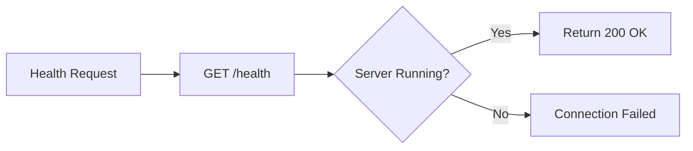

**Health Monitoring Explained:** Railway provides automatic health checks. A simple endpoint confirms the server is running and accepting connections.

### Logging

The server logs important events:
- New client connections
- Authentication attempts
- Room joins
- Event broadcasts
- Disconnections

---

## Security

### CORS Configuration

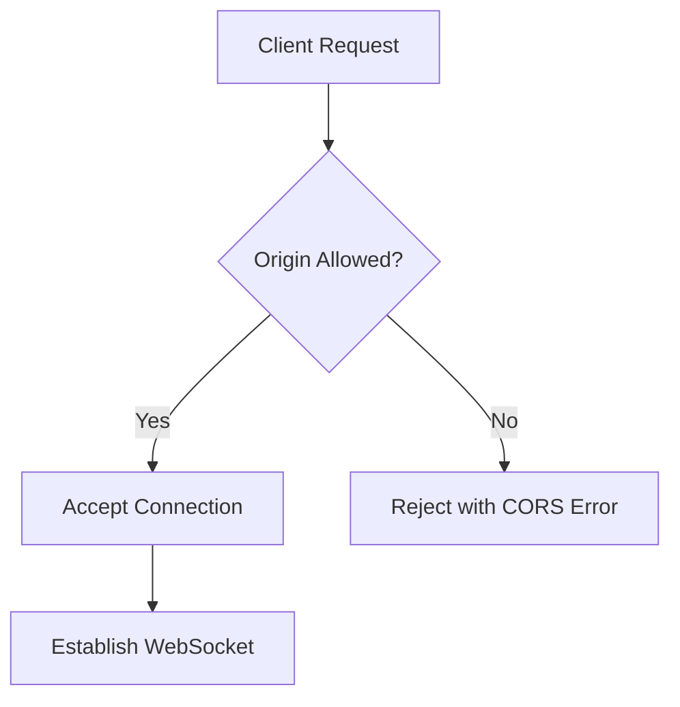

**Security Explained:** CORS ensures only the configured frontend origin can establish WebSocket connections, preventing unauthorized access.

### Authentication Flow

1. Client connects via WebSocket
2. Client emits `authenticate` event with credentials
3. Server validates and joins rooms
4. Unauthenticated clients receive no broadcasts

---

## Performance

### Connection Pooling Benefits

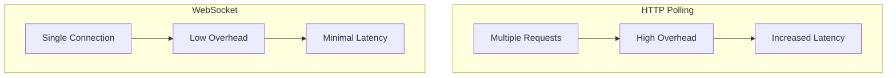

**Performance Benefits Explained:** A single WebSocket connection multiplexes all events, reducing connection overhead compared to multiple HTTP requests. This results in lower latency and more efficient bandwidth usage.

---

## Troubleshooting

### Common Issues

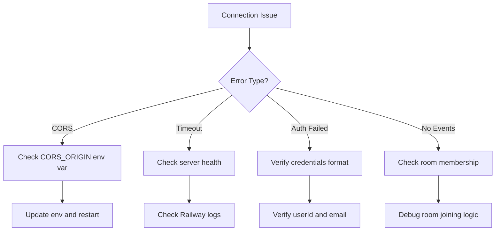

**Troubleshooting Guide Explained:** Most issues fall into four categories. CORS errors require environment variable fixes. Timeouts indicate server problems. Auth failures need credential verification. Missing events suggest room membership issues.

---

## Developer Information

<div align="center">

### **Ansh Sharma**

**National Institute of Technology Calicut**

---

[](https://github.com/anshsharmacse)

[](https://www.linkedin.com/in/anshsharmacse/)

</div>

---

## License

This project is released under the MIT License.

---

<div align="center">

**Built with Socket.io and deployed on Railway**

</div>
